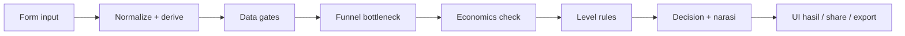
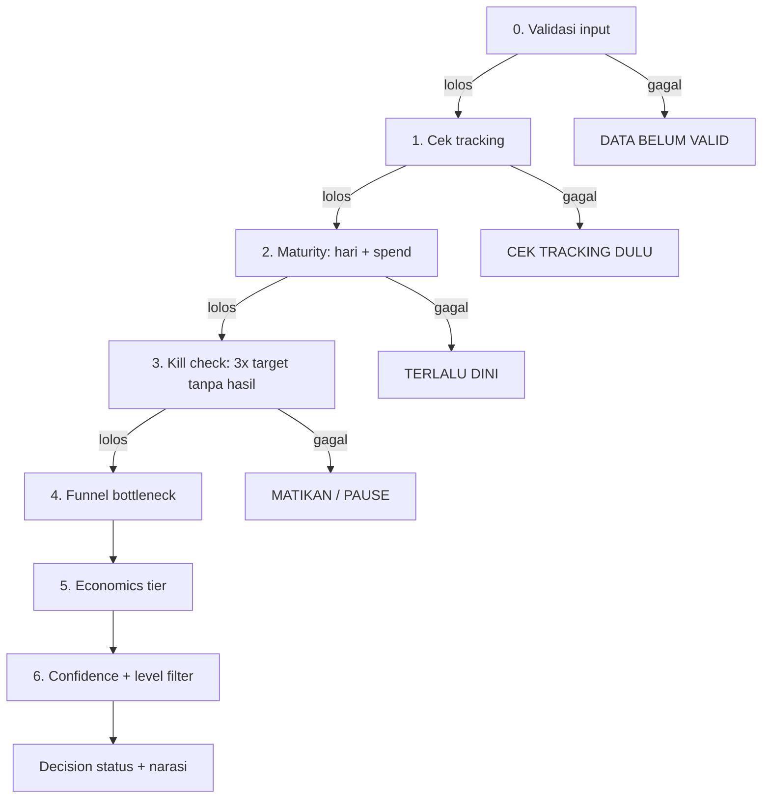
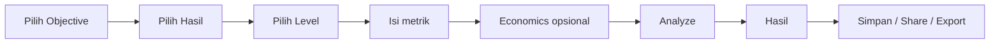

# Meta Ads Diagnostic Tool — Planning & Logika Keputusan

Sep 24, 2026 · @Dyrn

## Ringkasan produk

Kita membangun web app Next.js tanpa database yang membaca 5 metrik Ads Manager dan mengeluarkan satu keputusan tegas plus urutan tindakan. Semua logika hidup di kode (rule engine berbasis config), jadi hasilnya deterministik dan bisa diaudit.

**Masalah yang diselesaikan.** Advertiser melihat angka yang benar tapi membacanya salah: pause terlalu cepat, scale terlalu cepat, atau menyalahkan creative padahal masalahnya di landing page atau checkout.

**Prinsip produk (turunan Jordan Meta Ads Framework V3 + praktik Andromeda):**

1. **Satu konteks, satu diagnosis.** Objective × Hasil × Level menentukan metrik mana yang relevan. Metrik lain tidak boleh ikut menghakimi.
2. **Bottleneck dulu, efisiensi kemudian.** Engine mencari titik funnel pertama yang patah, lalu baru menilai biaya.
3. **Data belum cukup = jangan menyimpulkan.** Setiap keputusan punya gerbang volume minimal dan tingkat keyakinan.
4. **Economics menentukan batas.** Kalau harga dan biaya diisi, break-even CPA/CPL menjadi garis keputusan. Kalau kosong, tool tidak mengarang ROAS atau profit.
5. **Level menentukan wewenang.** Ad hanya menilai creative, Ad Set menilai audience dan delivery, Campaign menilai struktur dan budget.
6. **Output selalu bisa dikerjakan.** Format tetap: Sekarang, Jangan, Checkpoint berikutnya.

**Pembeda dari kompetitor (metaadsdiagnostic.my.id):**

- Break-even juga untuk Leads/WA lewat input *close rate* dan nilai deal, bukan berhenti di lead tercatat.
- Threshold bisa di-override per industri (preset: e-commerce, B2B/lead gen, jasa lokal, app).
- Mode pembanding periode (minggu ini vs minggu lalu) tanpa database, cukup input dua set angka.
- Hasil bisa diekspor sebagai gambar/PDF untuk laporan ke klien.

## Scope MVP (tanpa database)

MVP = satu halaman diagnosis + halaman panduan, 100% client-side, tanpa login dan tanpa server state. Riwayat disimpan di `localStorage` browser user.

| Fitur | MVP | Fase 2 | Catatan |
| --- | --- | --- | --- |
| Pilih Objective × Hasil × Level | Ya |  | 6 objective, 15 result path, 3 level |
| Form 5 metrik dinamis + validasi | Ya |  | Metrik berubah sesuai konteks |
| Economics opsional (harga, HPP/biaya) | Ya |  | Mengaktifkan break-even, ROAS, profit |
| Lead economics (close rate, nilai deal) | Ya |  | Untuk Leads/WA/Calls |
| Input durasi (hari berjalan) | Ya |  | Gerbang learning phase |
| Rule engine + decision status + narasi | Ya |  | Inti produk |
| Tombol Coba Skenario (sample data) | Ya |  | Untuk demo dan onboarding |
| Riwayat di localStorage | Ya |  | Maks 50 entri, bisa dihapus |
| Share hasil via URL (state di query string) | Ya |  | Tanpa database, link bisa dikirim ke klien |
| Export PNG/PDF hasil | Ya |  | html-to-image |
| Preset industri (threshold) | Ya |  | E-commerce, lead gen B2B, jasa lokal, app |
| Pembanding 2 periode |  | Ya | Input dua set angka, hitung delta |
| Paywall/akses berbayar |  | Ya | Lihat bagian Diferensiasi & monetisasi |
| Tarik data dari Meta Marketing API |  | Ya | Butuh OAuth + server, di luar prinsip no-DB |

**Batas yang disengaja:** tool tidak menebak data yang tidak diisi, tidak menilai kualitas creative secara visual, dan tidak memberi keputusan scale di level Ad.

## Arsitektur teknis Next.js

Static export Next.js (App Router) di Vercel: engine berjalan di browser, jadi hosting gratis, tidak ada biaya server, dan hasil instan.

| Lapisan | Pilihan | Alasan |
| --- | --- | --- |
| Framework | Next.js 15, App Router, `output: 'export'` | Bisa di-host statis, SEO landing tetap bagus |
| Bahasa | TypeScript strict | Rule engine butuh tipe yang ketat |
| UI | Tailwind CSS + shadcn/ui | Cepat, konsisten, dark theme mudah |
| Form | React Hook Form + Zod | Validasi angka per metrik dari config |
| State | Zustand (+ persist ke localStorage) | Riwayat dan preferensi tanpa database |
| Share | State → base64url di query string | Link hasil bisa dibuka ulang tanpa server |
| Export | html-to-image + jsPDF | Laporan untuk klien |
| Test | Vitest untuk engine, Playwright untuk alur | Engine wajib punya test case per skenario |
| Analytics | Vercel Analytics / Plausible | Tanpa data pribadi |
| Deploy | Vercel (domain sendiri) | Push ke GitHub → otomatis live |



Engine adalah fungsi murni `diagnose(input, preset) → Result` tanpa side effect, sehingga bisa dites dan dipindah ke API route kapan pun.

## Taksonomi input: Objective × Hasil × Level

User hanya mengisi angka mentah dari Ads Manager; rasio (CTR, CPM, CPC, frequency, CPL) dihitung engine. Ini mencegah angka yang saling bertentangan, misalnya CTR yang tidak cocok dengan klik dan impresi.

**Input global (semua konteks):** Ad Spend (Rp), Impressions, dan Hari berjalan (wajib). Rentang tanggal dan catatan bersifat opsional.

| Objective | Hasil yang dikejar | Metrik input (selain Spend + Impressions) | Metrik turunan utama |
| --- | --- | --- | --- |
| Awareness | Reach / Brand Awareness | Reach, ThruPlays (opsional), Est. Ad Recall Lift (opsional) | CPM, Frequency, cost per 1.000 reach |
| Traffic | Website / Landing Page | Reach, Link Clicks, Landing Page Views | CTR link, CPC, LPV rate, cost per LPV |
| Engagement | Post Engagement | Reach, Post Engagements, Shares + Saves | Engagement rate, CPE, share/save rate |
| Engagement | Video Engagement | Reach, 3-sec Video Plays, ThruPlays | Hook rate, hold rate, cost per ThruPlay |
| Engagement | Messaging Conversations | Link Clicks, Messaging Conversations Started | CTR, click-to-chat rate, cost per chat |
| Leads | Instant Form | Link Clicks, Leads | CTR, form CVR, CPL |
| Leads | Website Leads | Link Clicks, Landing Page Views, Leads | CTR, LPV rate, LP CVR, CPL |
| Leads | WhatsApp / Messaging | Link Clicks, Messaging Conversations Started | CTR, click-to-chat rate, cost per chat |
| Leads | Calls | Link Clicks, Calls Placed | CTR, click-to-call rate, cost per call |
| App Promotion | App Installs | Link Clicks, App Installs | CTR, click-to-install, CPI |
| App Promotion | App Events | Link Clicks, App Installs, App Events | CPI, install-to-event rate, cost per event |
| Sales | Website Purchase | Link Clicks, Landing Page Views, Initiate Checkout, Purchases | CTR, LPV rate, LP→IC, IC→Purchase, CPA |
| Sales | Catalog / Shop Purchase | Link Clicks, Add to Cart, Purchases | CTR, click→ATC, ATC→Purchase, CPA |
| Sales | WhatsApp (CTWA) Sales | Link Clicks, Messaging Conversations Started | Cost per chat → CPA estimasi via close rate |

**Economics opsional:**

- *Sales:* Harga jual rata-rata, HPP + biaya per penjualan, dan Purchase Conversion Value dari Meta (kalau ada, ROAS memakai angka ini).
- *Leads, WA, Calls, CTWA:* Nilai rata-rata deal, HPP/biaya per deal, % lead valid (default 70%, dari kalkulator Jordan), dan close rate dari lead valid.
- *App:* Nilai per install/event (LTV sederhana).

**Tambahan per level:**

- *Ad Set:* Reach menjadi wajib untuk membaca frequency dan kejenuhan audience.
- *Ad:* 3-sec Video Plays dan ThruPlays opsional untuk creative video, supaya hook rate dan hold rate bisa dinilai.

WhatsApp (CTWA) Sales sengaja ditambahkan sebagai result path baru karena ini jalur dominan di Indonesia dan tidak dibaca oleh kompetitor.

**Catatan arsitektur multi-platform.** Taksonomi disiapkan dengan lapisan Platform di paling atas: Platform → Objective → Hasil → Level. Pada MVP, satu-satunya platform yang aktif adalah Meta, dan selector platform belum ditampilkan di UI.

## Rumus metrik turunan dan economics

Semua garis keputusan berangkat dari Gross Profit per penjualan, mengikuti Ads Calculator Jordan: target biaya akuisisi = 33% dari gross profit, batas impas = 100% gross profit.

**Metrik turunan (dihitung engine, dibulatkan saat tampil):**

| Metrik | Rumus |
| --- | --- |
| CTR link (%) | Link Clicks ÷ Impressions × 100 |
| CPM (Rp) | Spend ÷ Impressions × 1.000 |
| CPC link (Rp) | Spend ÷ Link Clicks |
| Frequency (x) | Impressions ÷ Reach |
| LPV rate (%) | LPV ÷ Link Clicks × 100 |
| LP conversion (%) | Initiate Checkout (atau Leads) ÷ LPV × 100 |
| Checkout completion (%) | Purchases ÷ Initiate Checkout × 100 |
| Hook rate (%) | 3-sec Video Plays ÷ Impressions × 100 |
| Hold rate (%) | ThruPlays ÷ 3-sec Video Plays × 100 |
| Click-to-chat (%) | Conversations Started ÷ Link Clicks × 100 |
| Cost per result (Rp) | Spend ÷ hasil utama |

**Economics Sales:**

```latex
\text{GP} = P - C \qquad \text{CPA}_{\text{BE}} = \text{GP} \qquad \text{CPA}_{\text{target}} = 0{,}33 \times \text{GP}
```

```latex
\text{ROAS} = \frac{\text{Purchases} \times P}{\text{Spend}} \qquad \text{BER} = \frac{P}{\text{GP}} \qquad \text{Profit} = \text{Purchases} \times \text{GP} - \text{Spend}
```

P = harga jual rata-rata, C = HPP + biaya per penjualan, BER = break-even ROAS. Kalau Purchase Conversion Value diisi, ROAS memakai angka tersebut.

**Economics Leads, WA, Calls, dan CTWA** (lead dashboard → lead valid → deal):

```latex
\text{CPL}_{\text{BE}} = \text{GP}_{\text{deal}} \times v \times c \qquad \text{CPL}_{\text{target}} = 0{,}33 \times \text{CPL}_{\text{BE}}
```

v = % lead valid, c = close rate dari lead valid. Default v = 70% dan c = 7%, sehingga target CPL ≈ 4% dari target CPA; angka ini persis rumus CTWA di kalkulator Jordan. Preset high-ticket/B2B memakai v = 30% dan c = 40% (sheet rule of thumb di kalkulator yang sama).

**Tingkatan CPA terhadap gross profit** (dipakai decision engine):

| Tier | CPA ÷ GP | Arti |
| --- | --- | --- |
| Winning | ≤ 33% | Di bawah target akuisisi, layak scale |
| Profitable | 33–60% | Untung, tapi optimasi dulu sebelum scale agresif |
| Tipis | 60–100% | Mendekati impas, perlu perbaikan |
| Rugi | > 100% | Setiap penjualan merugi setelah iklan |

**Acuan budget:** budget harian ideal per campaign = 3 × target CPA (kalkulator Jordan). Batas kill = spend ≥ 3 × target CPA tanpa hasil (Framework 8, Fase 2).

## Framework decision engine

Engine mengevaluasi 7 gerbang secara berurutan dan berhenti di gerbang pertama yang gagal. Urutan ini yang membuat diagnosis tidak menyalahkan creative saat masalahnya ada di tracking atau checkout.



**Detail tiap gerbang:**

1. **Validasi input.** Tolak kombinasi mustahil: Reach > Impressions, Clicks > Impressions, Purchases > Initiate Checkout × 1,2, dan LPV > Link Clicks × 1,1. Toleransi kecil diberikan karena atribusi Meta bisa sedikit melebihi.
2. **Cek tracking.** Contoh pemicu: Link Clicks ≥ 50 tetapi LPV = 0 (pixel tidak jalan), LPV rate < 40% (halaman lambat atau pixel dobel/hilang), Initiate Checkout ≥ 10 dengan Purchases = 0 (event Purchase tidak terpasang atau payment gagal), dan CTWA dengan klik ≥ 50 tetapi chat = 0.
3. **Maturity.** Hari berjalan < 3 **atau** spend < 1 × target CPA/CPL menghasilkan TERLALU DINI. Dasarnya: learning phase Meta dan aturan minimal 3 hari penuh di Framework 8.
4. **Kill check.** Spend ≥ 3 × target CPA dengan 0 hasil utama menghasilkan MATIKAN / PAUSE, kecuali gerbang tracking menandai masalah. Untuk level Ad, statusnya menjadi MATIKAN CREATIVE.
5. **Funnel bottleneck.** Setiap tahap funnel dinilai *Sehat / Waspada / Kritis* terhadap threshold (lihat bagian Threshold). Tahap Kritis pertama dari atas menjadi bottleneck utama, dan tahap Waspada lainnya dicatat sebagai sekunder.
6. **Economics tier.** CPA atau CPL dibandingkan dengan GP: Winning, Profitable, Tipis, atau Rugi. Kalau economics kosong, engine memakai efisiensi relatif terhadap benchmark dan menandai "economics belum diisi".
7. **Confidence + level filter.** Confidence dihitung dari volume hasil, lalu status dibatasi sesuai wewenang level (lihat bagian Aturan per level).

**Confidence dari volume hasil** (Framework 8: winner butuh 10–15 purchase, di bawah 5–10 masih noise):

| Result path | Rendah | Sedang | Tinggi |
| --- | --- | --- | --- |
| Purchase / App Event | < 5 | 5–14 | ≥ 15 |
| Lead / Chat / Call / Install | < 10 | 10–29 | ≥ 30 |
| LPV / Klik (Traffic) | < 100 | 100–299 | ≥ 300 |
| Engagement / ThruPlay | < 300 | 300–999 | ≥ 1.000 |
| Reach (Awareness) | < 5.000 | 5.000–19.999 | ≥ 20.000 |

**Matriks keputusan** (setelah gerbang 0–4 lolos):

| Bottleneck | Economics tier | Confidence | Decision status | Kondisi |
| --- | --- | --- | --- | --- |
| Tidak ada | Winning | Tinggi | SCALE AGRESIF | KUAT |
| Tidak ada | Winning | Sedang | SCALE BERTAHAP | KUAT |
| Tidak ada | Profitable | Tinggi / Sedang | SCALE BERTAHAP | STABIL |
| Waspada saja | Winning / Profitable | Apa pun | OPTIMASI & PANTAU | STABIL |
| Kritis | Winning / Profitable | Apa pun | PERBAIKI \[TAHAP\] DULU | PERLU PERHATIAN |
| Apa pun | Tipis | Apa pun | PERBAIKI \[TAHAP\] DULU | PERLU PERHATIAN |
| Apa pun | Rugi | Sedang / Tinggi | PAUSE & ITERASI | KRITIS |
| Apa pun | Rugi | Rendah | LANJUT TES TERBATAS | PERLU PERHATIAN |
| Apa pun | Apa pun | Rendah (bukan Rugi) | LANJUT TES | STABIL |

Untuk "PERBAIKI \[TAHAP\] DULU", \[TAHAP\] diambil dari bottleneck: CREATIVE, LANDING PAGE, CHECKOUT, FOLLOW-UP CHAT, atau DELIVERY. Kalau tier Tipis tanpa bottleneck Kritis, tahap yang paling lemah dipilih.

**Aturan scale** (blueprint Jordan): naikkan budget 20–30% per hari untuk SCALE AGRESIF, 10–20% untuk SCALE BERTAHAP, dan jangan mengubah budget, audience, dan creative bersamaan.

## Threshold default & benchmark

Setiap tahap funnel punya dua batas: di atas batas Sehat dianggap aman, di bawah batas Kritis menjadi bottleneck. Nilai di antaranya berstatus Waspada.

Sumber diberi label per baris. Baris bertanda **FW** diambil dari materi Jordan (Framework 7–8, blueprint, dan Ads Calculator). Baris bertanda **Default** adalah titik awal perkiraan praktik umum pasar Indonesia, bukan data terverifikasi, dan wajib dikalibrasi dengan data kampanyemu sendiri.

| Tahap / metrik | Sehat | Kritis | Sumber |
| --- | --- | --- | --- |
| LPV rate (LPV ÷ klik) | ≥ 75% | < 50% | FW (toleransi drop 25%) |
| LP conversion (LPV → IC) | ≥ 20% | < 15% | FW (target LP > 20%, < 15% kurang) |
| Checkout completion (IC → Purchase) | ≥ 25% | < 12% | Default |
| CPC link | ≤ 1% GP | > 2% GP | FW (CPC max = 1% GP) |
| CPA (Sales) | ≤ 33% GP | > 100% GP | FW (target akuisisi 33%) |
| CPL (Leads/CTWA) | ≤ target CPL | > CPL impas | FW (rumus CTWA kalkulator) |
| CTR link (Sales/Traffic) | ≥ 1,2% | < 0,7% | Default (contoh FW: 1,42–2%) |
| CTR link (Leads B2B) | ≥ 0,8% | < 0,4% | Default |
| CPM | ≤ Rp40.000 | > Rp100.000 | Default |
| Frequency 7 hari (prospecting) | ≤ 2,5 | > 4,0 | Default |
| Frequency (Awareness) | 1,5–3,0 | > 5,0 | Default |
| Hook rate (3s ÷ impresi) | ≥ 30% | < 20% | Default |
| Hold rate (ThruPlay ÷ 3s) | ≥ 25% | < 15% | Default |
| Engagement rate (engagement ÷ reach) | ≥ 3% | < 1% | Default |
| Click-to-chat (chat ÷ klik) | ≥ 60% | < 40% | Default |
| % chat valid/merespon | ≥ 70% | < 50% | FW (asumsi 70% respon) |
| Instant form CVR (lead ÷ klik) | ≥ 15% | < 8% | Default |
| Website lead CVR (lead ÷ LPV) | ≥ 15% | < 7% | Default |
| Click → ATC (Catalog) | ≥ 8% | < 4% | Default |
| ATC → Purchase (Catalog) | ≥ 25% | < 10% | Default |
| Click → Install (App) | ≥ 20% | < 10% | Default |

**Preset industri** mengubah beberapa batas sekaligus supaya diagnosis tidak bias ke e-commerce:

| Preset | Penyesuaian utama |
| --- | --- |
| E-commerce / produk fisik (default) | Semua nilai di tabel atas |
| Digital product | LP conversion Sehat ≥ 24% (angka LP Jordan), checkout completion Sehat ≥ 40% |
| Lead gen B2B / high-ticket | CTR Leads B2B, CPM Sehat ≤ Rp70.000, v = 30%, c = 40% |
| Jasa lokal (CTWA/Calls) | Click-to-chat Sehat ≥ 50%, frequency Kritis > 5,0 (audience sempit) |
| App | Click → Install sebagai tahap utama, confidence memakai jumlah install |

Semua threshold disimpan di `config/thresholds.ts` dan bisa di-override user di panel **Pengaturan lanjutan** (tersimpan di localStorage).

## Rule table per objective dan hasil

Setiap result path punya urutan tahap funnel sendiri. Engine menilai tahap dari kiri ke kanan, dan bottleneck utama adalah tahap Kritis pertama.

| Result path | Urutan tahap yang dinilai | Hasil utama | Economics |
| --- | --- | --- | --- |
| Reach / Brand Awareness | CPM → Frequency → Hook/Hold (jika video) | Reach | Tidak (efisiensi saja) |
| Traffic – Landing Page | CPM → CTR → CPC → LPV rate | LPV | Tidak |
| Post Engagement | CPM → Engagement rate → Share/save rate | Engagement | Tidak |
| Video Engagement | CPM → Hook rate → Hold rate | ThruPlay | Tidak |
| Messaging Conversations | CPM → CTR → Click-to-chat | Chat | Opsional (lead economics) |
| Instant Form | CPM → CTR → Form CVR → CPL | Lead | Ya (lead economics) |
| Website Leads | CPM → CTR → LPV rate → Lead CVR → CPL | Lead | Ya |
| WhatsApp / Messaging (Leads) | CPM → CTR → Click-to-chat → CPL | Chat | Ya |
| Calls | CPM → CTR → Click-to-call → Cost per call | Call | Ya |
| App Installs | CPM → CTR → Click-to-install → CPI | Install | Opsional (nilai install) |
| App Events | CTR → Click-to-install → Install-to-event → Cost per event | Event | Opsional |
| Website Purchase | CPM → CTR → LPV rate → LP conversion → Checkout completion → CPA | Purchase | Ya |
| Catalog / Shop Purchase | CPM → CTR → Click-to-ATC → ATC-to-Purchase → CPA | Purchase | Ya |
| WhatsApp (CTWA) Sales | CPM → CTR → Click-to-chat → CPA estimasi | Chat → deal | Ya |

**Pustaka bottleneck:** apa artinya kalau tahap tertentu Kritis, dan apa yang harus dilakukan.

| Tahap Kritis | Penyebab paling mungkin | Sekarang | Jangan |
| --- | --- | --- | --- |
| CPM tinggi | Audience terlalu sempit, creative berkualitas rendah di mata Meta, musim lelang ramai | Buka ke broad targeting, tambah variasi creative (Andromeda) | Menyempitkan interest lagi |
| Frequency tinggi | Audience jenuh, creative itu-itu saja | Tambah 3–5 creative baru dengan hook berbeda | Menaikkan budget pada adset yang sama |
| CTR rendah | Hook tidak menghentikan scroll atau angle tidak nyambung | Uji 3 angle (Hardselling, Pain, Gain) × 3 hook baru | Mengganti landing page dulu |
| Hook rate rendah | 3 detik pertama lemah | Buat 10 hook untuk 1 body (aturan "10 Hook = 1 Body") | Mengubah body/script sekaligus |
| Hold rate rendah | Body script tidak menahan, terlalu lama ke inti | Pakai struktur P.A.S atau Hasil-Hasil-Hasil, potong durasi | Menyalahkan targeting |
| LPV rate rendah | Halaman lambat, redirect, pixel dobel, atau klik tidak sengaja | Tes kecepatan mobile (< 3 detik), cek Pixel Helper | Menambah budget |
| LP conversion rendah | Headline tidak nyambung dengan iklan, offer lemah, bukti kurang | Samakan pesan iklan dan headline, pakai LP1 P.A.S / LP2 PROOF | Mengganti creative yang CTR-nya sudah sehat |
| Checkout completion rendah | Ongkir kaget, metode bayar terbatas, form panjang, event Purchase tidak jalan | Tes checkout di HP, tampilkan total harga lebih awal, cek event | Merombak struktur campaign |
| Click-to-chat rendah | WA tidak terbuka, pesan pembuka tidak jelas, nomor bermasalah | Tes tombol WA di iOS dan Android, perbaiki pre-filled message | Menyimpulkan creative gagal |
| Form CVR rendah | Form terlalu panjang atau offer di form tidak jelas | Kurangi field, perjelas benefit di intro form | Memakai higher intent sebelum volume cukup |
| CPA/CPL di atas impas | Salah satu tahap di atas, atau harga/margin terlalu tipis | Perbaiki tahap terlemah; tinjau offer dan harga | Scale untuk "mengejar volume" |

**Aturan khusus per objective:**

- **Awareness** tidak pernah menghasilkan status SCALE AGRESIF. Keputusannya berkisar di efisiensi (CPM, cost per 1.000 reach) dan kesehatan frequency.
- **Traffic dan Engagement** memberi peringatan bahwa objective ini mengoptimasi klik atau interaksi, bukan penjualan. Kalau user sebenarnya mengejar penjualan, engine menyarankan pindah ke objective Sales atau Leads.
- **Leads dan CTWA** menandai bahwa lead dashboard ≠ lead valid. Tanpa % valid dan close rate, CPL hanya dinilai terhadap default kalkulator.
- **Sales dengan CTR tinggi tetapi purchase 0** mengikuti Framework 8: CTR tinggi tanpa pembelian adalah sinyal palsu, jadi engine mengecek LP dan checkout sebelum memuji creative.
- **Profit ada, tetapi jumlah purchase < 5** tidak pernah menghasilkan SCALE. Statusnya LANJUT TES dengan catatan "kandidat winner, data masih tipis".

## Aturan per level Campaign / Ad Set / Ad

Level menentukan wewenang keputusan: status yang tidak diizinkan untuk suatu level diturunkan ke status terdekat yang diizinkan.

| Aspek | Campaign | Ad Set | Ad |
| --- | --- | --- | --- |
| Pertanyaan yang dijawab | Apakah struktur dan budget ini layak dilanjutkan? | Apakah audience/kelompok topik ini bekerja dan belum jenuh? | Apakah creative ini menarik orang yang tepat? |
| Metrik yang paling berbobot | CPA vs GP, ROAS, profit | Frequency, CPM, CPA, share spend | CTR, hook rate, hold rate, cost per result |
| Status yang diizinkan | Semua | Semua kecuali SCALE AGRESIF bila frequency Waspada | PERTAHANKAN CREATIVE, ITERASI CREATIVE, MATIKAN CREATIVE, LANJUT TES |
| Batas penyebutan penyebab | Tidak boleh menunjuk satu creative | Boleh menyebut kejenuhan audience | Boleh menyebut hook/body, tidak boleh menyimpulkan LP bermasalah dari satu ad saja |
| Aturan spend | Spend total menentukan maturity | Spend adset dibanding target CPA | Spend antar-ad tidak harus rata; ad dengan spend < 1 × target CPA berstatus LANJUT TES |
| Rujukan fase Framework 8 | Fase 3–5 (winner, scale) | Fase 1 (satu adset per topik) | Fase 1–2 (matriks Topic × Angle × Hook) |

**Pemetaan status untuk level Ad:**

| Status di Campaign/Ad Set | Menjadi di level Ad |
| --- | --- |
| SCALE AGRESIF / SCALE BERTAHAP | PERTAHANKAN CREATIVE (kandidat Fase 2 Optimasi) |
| OPTIMASI & PANTAU | PERTAHANKAN CREATIVE |
| PERBAIKI CREATIVE DULU | ITERASI CREATIVE (ganti hook dulu, body tetap) |
| PERBAIKI LANDING PAGE / CHECKOUT DULU | PERTAHANKAN CREATIVE + catatan "cek di level Campaign" |
| PAUSE & ITERASI / MATIKAN | MATIKAN CREATIVE |

Atas dasar Fase 2 Framework 8, ad yang menghasilkan purchase tetapi CPA-nya di atas impas tetap diberi status LANJUT TES 2–3 hari, bukan langsung dimatikan.

## Struktur output dan template narasi

Hasil selalu tampil dalam 6 blok dengan urutan tetap, supaya user langsung tahu keputusan sebelum membaca alasan.

1. **Decision Status + Kondisi**, dengan warna: hijau (KUAT/STABIL), kuning (PERLU PERHATIAN), merah (KRITIS), abu-abu (DATA BELUM VALID / TERLALU DINI).
2. **5 KPI card** sesuai konteks. Contoh Sales: Purchase, CPA, Break-even CPA, ROAS, Profit setelah iklan. KPI yang butuh economics tampil "Isi economics" kalau kosong.
3. **Funnel bar**: setiap tahap berlabel Sehat/Waspada/Kritis dengan angka dan batasnya.
4. **Ringkasan diagnosis** (3–5 kalimat).
5. **Checkpoint data** (3 baris bukti angka).
6. **Next action**: Sekarang, Jangan, Tahan sampai, dan Checkpoint berikutnya.

**Komposisi narasi.** Setiap kalimat berasal dari slot template yang diisi angka. Tidak ada AI, jadi hasil selalu konsisten.

| Slot | Isi | Contoh |
| --- | --- | --- |
| Pembuka | Kalimat per decision status | "Belum aman untuk scale; ada satu titik yang perlu dibereskan dulu." |
| Funnel | Tahap yang sehat, lalu bottleneck | "260 LPV sudah menjadi 24 checkout, tetapi belum ada purchase tercatat." |
| Economics | Tier CPA vs GP, atau catatan economics kosong | "CPA Rp58.333 berada di 56% gross profit: untung, tetapi di atas target 33%." |
| Level | Batas wewenang level | "Di level Campaign, angka ini gabungan semua ad set, jadi belum menunjuk satu creative." |
| Confidence | Volume hasil dan apa artinya | "Keyakinan sedang: 6 purchase cukup untuk arah, belum cukup untuk memastikan winner." |

**Pustaka next action** disimpan per status × bottleneck × level di `config/actions.ts`. Setiap entri berisi 1 aksi Sekarang, 1 larangan Jangan, 1 syarat Tahan, dan 1 Checkpoint berikutnya yang terukur. Contoh untuk PERBAIKI CHECKOUT DULU (Campaign, Website Purchase):

```markdown
Sekarang: audit alur checkout sampai payment di HP dan jalankan test event Purchase.
Jangan: rombak struktur campaign atau ganti creative; sinyal sudah sampai checkout.
Tahan: jangan naikkan budget sampai purchase pertama tercatat dan event tervalidasi.
Checkpoint berikutnya: setelah 5 checkout tambahan, checkout completion minimal 12%.
```

**Catatan wajib di bawah hasil:** "Diagnosis ini hanya membaca angka yang diisi. Keputusan budget tetap keputusan finansialmu." Ini sejalan dengan prinsip Framework V3 bahwa angka finansial adalah keputusan user.

## UI/UX flow dan halaman

Aplikasi terdiri dari 4 route. Alur utama dari landing sampai hasil ditargetkan selesai dalam kurang dari 60 detik.

| Route | Isi | Catatan |
| --- | --- | --- |
| `/` | Landing page: masalah, contoh hasil, cara kerja 3 langkah, CTA "Mulai Diagnosis" | Struktur LP2 PROOF: hook, bukti (contoh hasil), cara kerja, CTA |
| `/diagnosis` | Pilih konteks → form metrik → economics → hasil | Satu halaman, hasil muncul di bawah form dan auto-scroll |
| `/riwayat` | Daftar diagnosis dari localStorage, buka ulang, hapus | Maksimal 50 entri, hapus satu atau semua |
| `/panduan` | Glosarium metrik, cara ambil angka di Ads Manager, arti tiap status | Bisa jadi konten SEO |



**Detail interaksi penting:**

- Dropdown Hasil hanya menampilkan result path milik Objective terpilih. Field metrik berubah otomatis, dengan tooltip "cara ambil di Ads Manager" per field.
- Input angka memakai format Indonesia (titik ribuan, koma desimal) dan menerima paste "Rp1.250.000".
- Validasi berjalan langsung: field merah dengan pesan spesifik, misalnya "LPV tidak mungkin melebihi Link Clicks lebih dari 10%".
- Tombol Analyze aktif setelah semua field wajib terisi. Tombol **Coba Skenario** mengisi data contoh yang berbeda-beda (sehat, bottleneck LP, bottleneck checkout, rugi).
- Panel **Pengaturan lanjutan** (tertutup default): pilih preset industri dan override threshold.
- Hasil bisa dibagikan lewat tombol **Salin link**; state dikodekan di URL, sehingga klien bisa membuka hasil yang sama.
- Tampilan mobile-first: form satu kolom, KPI card 2 kolom, funnel bar vertikal.

**Arah visual:** dark navy dengan aksen teal untuk sehat, amber untuk waspada, dan merah untuk kritis. Tipografi Inter atau Plus Jakarta Sans. Hindari meniru layout kompetitor secara identik; gunakan funnel bar sebagai elemen visual pembeda.

## Struktur kode, tipe data, dan engine

Logika dipisah menjadi config (data) dan engine (fungsi murni). Menambah result path baru cukup dengan menambah entri config tanpa mengubah engine.

```text
src/
  app/
    page.tsx                 # landing
    diagnosis/page.tsx       # form + hasil
    riwayat/page.tsx
    panduan/page.tsx
  components/
    ContextPicker.tsx  MetricForm.tsx  EconomicsForm.tsx
    ResultHeader.tsx   KpiCards.tsx    FunnelBar.tsx
    DiagnosisText.tsx  NextActions.tsx ShareExport.tsx
  config/
    objectives.ts            # objective → result path → level → metrik
    metrics.ts               # label, unit, tooltip, validasi per metrik
    thresholds.ts            # batas Sehat/Kritis + preset industri
    actions.ts               # pustaka next action per status × tahap × level
    narratives.ts            # template kalimat
  engine/
    derive.ts  validate.ts  gates.ts  funnel.ts
    economics.ts  confidence.ts  decide.ts  narrate.ts
    index.ts                 # diagnose(input, preset)
  store/useHistory.ts        # Zustand + persist localStorage
  lib/share.ts               # encode/decode state ke URL
  tests/engine/*.test.ts
```

Supaya siap multi-platform tanpa refactor, isi `config/` ditempatkan di subfolder `config/meta/` dan setiap `ResultPathConfig` membawa field `platform: 'meta'`. Engine di `engine/` tetap satu dan tidak tahu platform apa yang sedang dinilai; perbedaan platform hanya ada di config.

```ts
type Objective = 'awareness'|'traffic'|'engagement'|'leads'|'app'|'sales';
type Level = 'campaign'|'adset'|'ad';
type StageStatus = 'sehat'|'waspada'|'kritis'|'na';

interface ResultPathConfig {
  id: string;                      // 'sales_website'
  objective: Objective;
  label: string;
  inputs: MetricKey[];             // wajib
  optionalInputs?: MetricKey[];
  levelExtras?: Partial<Record<Level, MetricKey[]>>;
  stages: StageDef[];              // urutan funnel
  primaryResult: MetricKey;        // 'purchases'
  confidenceScale: 'purchase'|'lead'|'traffic'|'engagement'|'reach';
  economics: 'sales'|'lead'|'app'|'none';
}

interface StageDef {
  key: string;                     // 'lp_conversion'
  label: string;
  compute: (m: Metrics) => number | null;
  thresholdKey: string;            // rujukan ke thresholds.ts
  direction: 'higher_better'|'lower_better';
  bottleneckTag: 'DELIVERY'|'CREATIVE'|'LANDING PAGE'|'CHECKOUT'|'FOLLOW-UP CHAT'|'FORM';
}

interface DiagnosisResult {
  status: DecisionStatus;  kondisi: Kondisi;  confidence: 'rendah'|'sedang'|'tinggi';
  kpis: Kpi[];  stages: StageResult[];  bottleneck?: StageResult;
  economicsTier?: 'winning'|'profitable'|'tipis'|'rugi';
  narrative: string[];  checkpoints: string[];
  actions: { sekarang: string; jangan: string; tahan: string; berikutnya: string };
  flags: string[];                 // tracking, economics kosong, dll.
}
```

```ts
export function diagnose(input: DiagnosisInput, preset: Preset): DiagnosisResult {
  const cfg = getResultPath(input.resultPath);
  const m = derive(input.metrics, cfg);                 // CTR, CPM, rasio, dll.
  const errors = validate(m, cfg);
  if (errors.length) return build('DATA_BELUM_VALID', { errors });

  const tracking = checkTracking(m, cfg);
  if (tracking.blocking) return build('CEK_TRACKING', { tracking });

  const eco = computeEconomics(input.economics, m, cfg); // GP, target, BE, tier
  if (!isMature(input.daysRunning, m.spend, eco))       // < 3 hari / < 1x target
    return build('TERLALU_DINI', { eco });

  if (m.primary === 0 && m.spend >= 3 * eco.targetCost)
    return build(input.level === 'ad' ? 'MATIKAN_CREATIVE' : 'PAUSE_ITERASI', { eco });

  const stages = cfg.stages.map(s => scoreStage(s, m, preset)); // sehat/waspada/kritis
  const bottleneck = stages.find(s => s.status === 'kritis');
  const confidence = scoreConfidence(m.primary, cfg.confidenceScale);

  let status = decisionMatrix({ bottleneck, stages, tier: eco.tier, confidence });
  status = applyLevelFilter(status, input.level, m);    // Ad tidak boleh SCALE
  status = applyObjectiveRules(status, cfg, m);         // Awareness tidak SCALE AGRESIF

  return build(status, { stages, bottleneck, eco, confidence,
    narrative: narrate(...), actions: pickActions(status, bottleneck, input.level) });
}
```

## Roadmap build, test case, dan QA

Target: MVP live dalam 4 minggu, dengan engine yang dites lebih dulu sebelum UI dibangun.

| Minggu | Deliverable | Selesai jika |
| --- | --- | --- |
| 1 | `config/*` lengkap untuk 14 result path + engine + unit test | ≥ 40 test case lulus di Vitest |
| 2 | Halaman `/diagnosis`: form dinamis, validasi, hasil, funnel bar, riwayat, share URL | Semua result path bisa dianalisis end-to-end |
| 3 | Landing page, `/panduan`, export PNG/PDF, preset industri, pengaturan lanjutan | Lighthouse mobile ≥ 90, lolos QA checklist |
| 4 | Beta tertutup 5–10 advertiser, kalibrasi threshold, perbaikan copy | ≥ 80% tester menilai diagnosis "masuk akal" |

**Test case inti (regression):**

| # | Konteks | Input ringkas | Status yang diharapkan |
| --- | --- | --- | --- |
| 1 | Sales Website, Campaign | Spend 350rb, 5 hari, LPV 260, IC 24, Purchase 6, P 149rb, C 45rb | PERBAIKI LANDING PAGE DULU (LP conv 9,2% < 15%, CPA 56% GP) |
| 2 | Sales Website, Campaign | Sama dengan #1 tetapi Purchase 0 | CEK TRACKING DULU (IC ≥ 10, Purchase 0) |
| 3 | Sales Website, Campaign | Hari berjalan 2 | TERLALU DINI |
| 4 | Sales Website, Campaign | Spend 400rb, Purchase 0, IC 3, target CPA 34rb | PAUSE & ITERASI (spend ≥ 3 × target) |
| 5 | Sales Website, Campaign | 20 purchase, CPA 25% GP, semua tahap sehat, frequency 1,8 | SCALE AGRESIF |
| 6 | Sales Website, Ad | Seperti #5 | PERTAHANKAN CREATIVE |
| 7 | Leads WhatsApp, Ad Set | Klik 300, chat 90 (30%) | PERBAIKI FOLLOW-UP CHAT DULU |
| 8 | Awareness, Ad Set | Frequency 5,5, CPM 45rb | PERBAIKI DELIVERY DULU (refresh creative) |
| 9 | Traffic, Campaign | Link Clicks 200, LPV 240 | DATA BELUM VALID |
| 10 | Leads Instant Form, Campaign | 12 lead, CPL di bawah target, tanpa economics | OPTIMASI & PANTAU + flag "economics belum diisi" |

Test case #1 sengaja memberi hasil berbeda dari demo kompetitor (mereka memberi SCALE BERTAHAP). Menurut benchmark LP Jordan, konversi LPV → checkout 9,2% masih di bawah 15%, jadi memperbaiki LP akan menaikkan profit lebih cepat daripada menambah budget.

**QA checklist:**

- [ ] Setiap kombinasi Objective × Hasil × Level merender field yang benar
- [ ] Angka 0, kosong, dan desimal koma diproses benar
- [ ] Link share membuka hasil identik di browser lain
- [ ] Riwayat bertahan setelah refresh dan bisa dihapus
- [ ] Tampilan benar di layar 360 px dan desktop
- [ ] Semua teks status dan aksi memakai bahasa Indonesia yang konsisten
- [ ] Tidak ada request jaringan yang mengirim angka user (privasi)

## Roadmap multi-platform (setelah MVP Meta)

Pengembangan saat ini khusus Meta Ads. Platform lain baru dikerjakan setelah MVP Meta live dan threshold-nya terkalibrasi dari data beta. Yang disiapkan sekarang hanya struktur config per platform, tanpa fitur atau UI tambahan.

| Urutan | Platform | Struktur level | Metrik khas | Yang dipakai ulang | Syarat mulai |
| --- | --- | --- | --- | --- | --- |
| 1 (sekarang) | Meta Ads | Campaign / Ad Set / Ad | CPM, frequency, hook rate, LPV rate | — | — |
| 2 | TikTok Ads | Campaign / Ad Group / Ad | 2s/6s view rate, CTR, CPM | Sekitar 80% config Meta, economics, engine | MVP Meta stabil |
| 3 | Google Ads (Search + PMax) | Campaign / Ad Group / Keyword / Ad, per tipe campaign | Impression share, lost IS (budget/rank), Quality Score, search terms, conversion rate | Engine, economics, narasi, UI | Aturan disusun dari framework Google Ads Cuan Formula |
| 4 | ChatGPT Ads | Masih sederhana | Impresi, klik, CTR, CPM, CPC, konversi via pixel/CAPI | Engine, economics | Tersedia untuk advertiser dan pengguna Indonesia, benchmark cukup |

**Status ChatGPT Ads per September 2026:** self-serve Ads Manager beta dibuka untuk advertiser AS sejak 5 Mei 2026, dengan CPC/CPM bidding, pixel, dan Conversions API. Iklan baru tayang di sejumlah negara (AS, Kanada, Australia, Selandia Baru, dan beberapa pasar pilot), belum Indonesia. ([OpenAI](https://openai.com/index/new-ways-to-buy-chatgpt-ads/), [Flyweel](https://www.flyweel.co/blog/openai-launches-chatgpt-ads))

**Perbedaan logika yang perlu disiapkan nanti:**

- **TikTok** memakai gerbang dan funnel yang sama dengan Meta. Hanya metrik creative (view rate) dan threshold yang berbeda.
- **Google Search** punya bottleneck yang tidak ada di Meta: keyword dan search term tidak relevan, budget terbatas (lost IS budget), atau ranking lemah (lost IS rank). Jadi perlu tahap funnel baru sebelum CTR.
- **ChatGPT Ads** baru bisa dinilai dari efisiensi klik dan konversi. Gerbang confidence perlu dibuat lebih ketat sampai ada benchmark yang stabil.

## Diferensiasi & monetisasi

Posisi yang disarankan: "diagnosis Meta Ads yang membaca sampai closing", dengan fokus pada jalur WhatsApp yang dominan di Indonesia.

| Aspek | Kompetitor (metaadsdiagnostic.my.id) | Tool kita |
| --- | --- | --- |
| Result path | 13, berhenti di lead tercatat | 14, termasuk CTWA Sales dengan economics sampai deal |
| Threshold | Tetap | Preset industri + override user |
| Economics Leads | Tidak ada | Break-even CPL dari % valid dan close rate |
| Visual funnel | Teks checkpoint | Funnel bar per tahap dengan batas |
| Bagikan ke klien | Tidak terlihat | Link share + export PNG/PDF |
| Akses | Berbayar Rp99rb, login OTP | Lihat opsi di bawah |

**Opsi monetisasi tanpa database:**

1. **Gratis sepenuhnya** sebagai lead magnet untuk jasa RIAS/Trilogic. CTA di hasil: "Mau campaign ini diaudit langsung? Konsultasi." Paling sederhana dan tanpa backend.
2. **Freemium dengan license key.** Status dan narasi gratis; export PDF, preset industri, dan pembanding periode dibuka dengan kode lisensi. Kode dijual lewat Lynk.id/Mayar dan divalidasi lewat daftar hash di environment variable, tanpa database.
3. **Berbayar penuh** seperti kompetitor. Ini butuh whitelist email dan OTP, jadi prinsip no-DB harus dilanggar (minimal Supabase atau KV).

Rekomendasi: mulai dari opsi 1 selama beta untuk mengumpulkan feedback dan kalibrasi threshold, lalu pindah ke opsi 2 setelah ada bukti nilai.

**Sumber framework yang dipakai di dokumen ini** (file project): Framework 8 Ads Management (5 Fase), SKILL Meta Ads Digital Selling V3, transkrip Blueprint Strategi Beriklan, transkrip High Converting Landing Pages, dan Ads Calculator v1.0 Jordan Digital (sheet Form dan rule of thumb).
